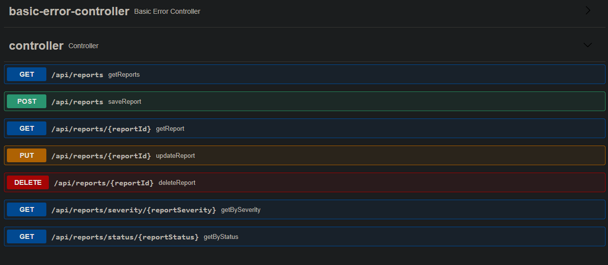

# Spring Swagger

## General info
It's a simple web API application using the H2 DataBase to make queries via HTTP.
To present functionality I used reports as customer submissions that can be manipulated.
For ease of use, a Swagger UI has been added to process queries.

## Manual Guide

To run Internet applications on your device, compile SpringSwaggerApplication and then enter in the browser:

- [http://localhost:8080/swagger-ui/](http://localhost:8080/swagger-ui/)
    to display Swagger UI.
- [http://localhost:8080/h2](http://localhost:8080/h2)
  to display Swagger UI.
- For example ([http://localhost:8080/api/reports](http://localhost:8080/api/reports)) 
to realize query without using Swagger.

### Technologies used

- Java (Spring)
- H2 DataBase
- Maven
- Swagger

### Browser support

The project has been prepared for the browser Google Chrome v84+

Tested on IntelliJ IDEA ultimate 2021.2.2

### Sample program resylts

